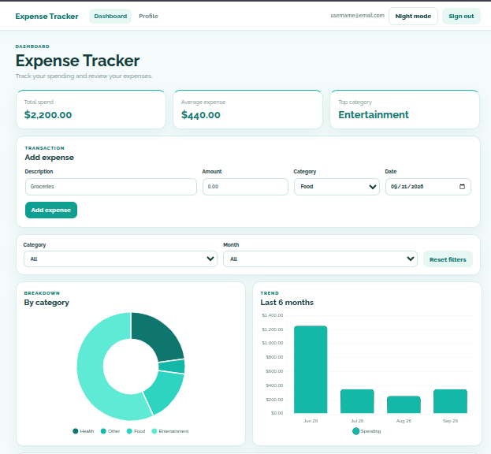
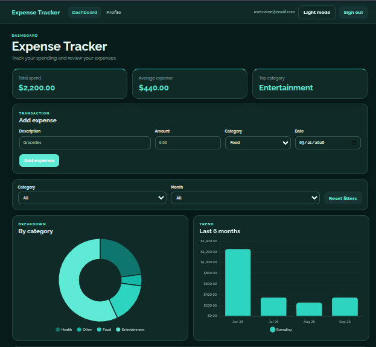
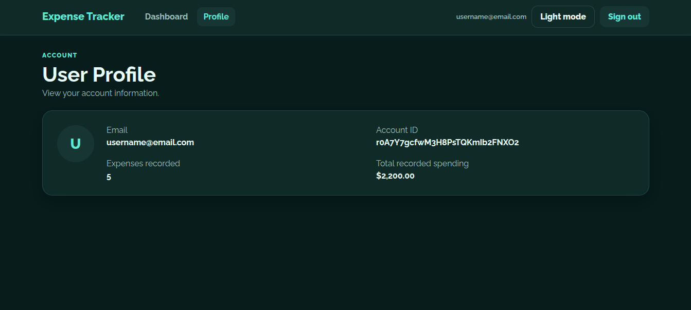

# Expense Tracker

A responsive personal finance dashboard built with React, Firebase, and Chart.js.

The app allows users to securely track expenses, analyze spending patterns, filter transactions, and view account-level summaries through a clean light/dark interface.

## Screenshots

### Dashboard



### Dark Mode



### Profile



## Features

- Firebase email/password authentication
- Real-time expense storage with Cloud Firestore
- Add, edit, and delete expenses
- Filter expenses by category and month
- Spending summary metrics
- Category breakdown using a doughnut chart
- Six-month spending trend using a bar chart
- Dashboard and profile routes
- Light and dark themes
- Persistent theme preference with `localStorage`
- Responsive mobile-friendly layout

## Tech Stack

- **React**
- **Vite**
- **Firebase Authentication**
- **Cloud Firestore**
- **React Router**
- **Chart.js**
- **react-chartjs-2**
- **CSS**
- **Raleway**

## Screenshots

Add screenshots or a short GIF here to demonstrate the dashboard, charts, profile page, and dark mode.

```text
docs/
├── dashboard.png
├── dark-mode.png
└── profile.png
```

## Project Structure

```text
src/
├── components/
│   ├── AuthForm.jsx
│   ├── ExpenseCharts.jsx
│   ├── ExpenseForm.jsx
│   ├── ExpenseTable.jsx
│   └── Navbar.jsx
├── pages/
│   └── Profile.jsx
├── lib/
│   └── firebase.js
├── App.jsx
├── main.jsx
└── styles.css
```

## How It Works

Each authenticated user has their own Firestore expense collection:

```text
users/{userId}/expenses/{expenseId}
```

Expense data is synchronized with Firestore in real time using snapshot listeners.

The dashboard derives totals, averages, category summaries, filters, and chart data from the authenticated user's expense records.

## Getting Started

Clone the repository:

```bash
git clone <https://github.com/ItsOlu/expense-tracker>
cd expense-tracker
```

Install dependencies:

```bash
npm install
```

Create a `.env` file in the project root:

```env
VITE_FIREBASE_API_KEY=your_api_key
VITE_FIREBASE_AUTH_DOMAIN=your_project.firebaseapp.com
VITE_FIREBASE_PROJECT_ID=your_project_id
VITE_FIREBASE_STORAGE_BUCKET=your_storage_bucket
VITE_FIREBASE_MESSAGING_SENDER_ID=your_sender_id
VITE_FIREBASE_APP_ID=your_app_id
```

Start the development server:

```bash
npm run dev
```

## Firebase Setup

To run your own instance:

1. Create a Firebase project.
2. Register a Firebase Web App.
3. Enable **Email/Password** under Firebase Authentication.
4. Create a Cloud Firestore database.
5. Add your Firebase configuration to `.env`.
6. Configure Firestore security rules so users can only access their own expense data.

Example structure:

```text
users
└── userId
    └── expenses
        ├── expenseId
        └── expenseId
```

## Production Build

Create a production build with:

```bash
npm run build
```

Preview it locally with:

```bash
npm run preview
```

## Technical Highlights

### Authentication

Firebase Authentication manages user registration, login, session persistence, and logout.

### Real-Time Data

Firestore snapshot listeners keep the expense dashboard synchronized with database changes without requiring manual refreshes.

### Data Visualization

Chart.js is used for:

- category-based spending breakdowns
- recent monthly spending trends

Charts also adapt visually to the selected light or dark theme.

### Responsive UI

The interface uses responsive CSS layouts for dashboard cards, forms, charts, navigation, tables, and the profile view.

### Theme Persistence

The selected theme is stored in `localStorage`, allowing the user's preference to persist between sessions.

## Security

Firebase configuration values used by the client are stored through environment variables.

Sensitive credentials, service-account keys, and private configuration files should never be committed to the repository.

Firestore security rules should restrict expense documents to their authenticated owner.

## Future Improvements

Potential additions include:

- budgets and spending limits
- recurring expenses
- additional chart types
- date-range filtering
- CSV export
- receipt uploads
- password reset
- editable user profiles
- automated testing
- deployment with Firebase Hosting or Vercel

## Note

Built as a full-stack project demonstrating React application architecture, Firebase integration, authentication, real-time data handling, routing, responsive UI design, and data visualization.
